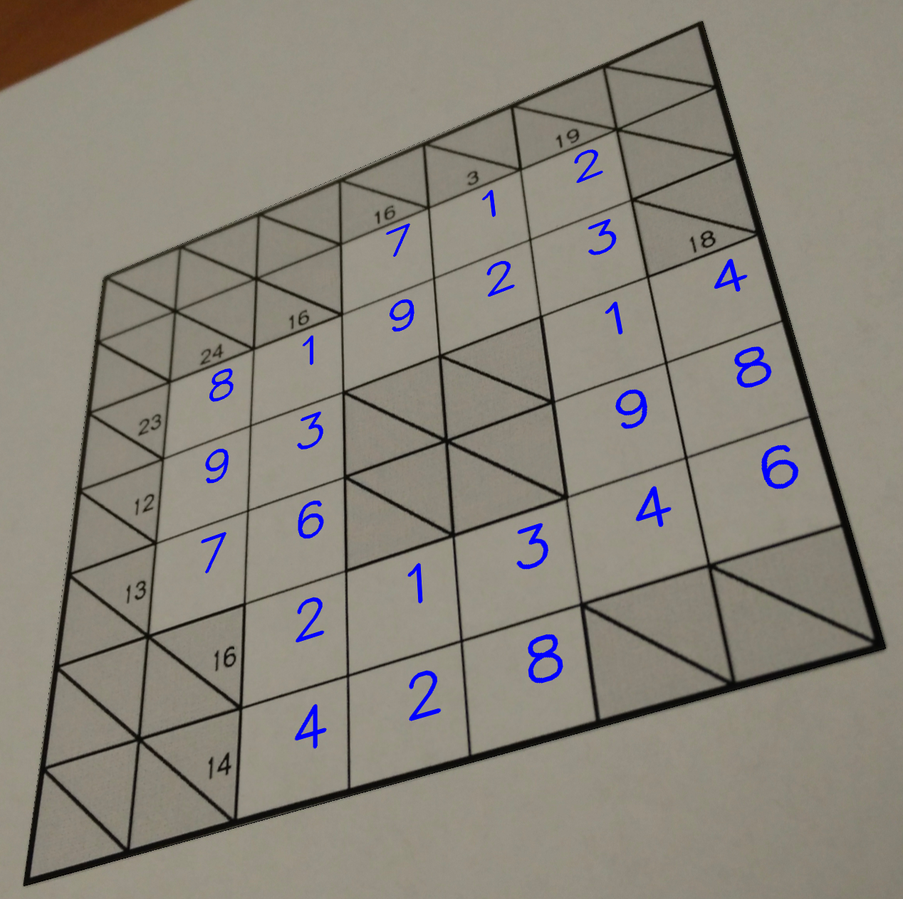

# Kakuro Solver with Image Processing and MNIST Digit Recognition

This project provides a fully automated solution to Kakuro puzzles using computer vision, deep learning, and constraint satisfaction problem (CSP) techniques. Given an image of a Kakuro puzzle, the system detects the grid, extracts numbers, solves the puzzle, and overlays the solution back onto the original image.

---

## Features

- **Automatic Kakuro Grid Detection**  
  Detects the puzzle boundaries and corrects the perspective using OpenCV.

- **Cell Segmentation**  
  Divides the puzzle into individual cells for processing.

- **Digit Recognition using MNIST CNN**  
  Recognizes digits in constraint cells (sum hints) using a convolutional neural network trained on MNIST.

- **Kakuro Solver**  
  Solves the puzzle using a backtracking algorithm with sum constraints.

- **Solution Overlay**  
  Projects the solved numbers back onto the original puzzle image, maintaining perspective and formatting.

---

## Project Structure

```
project/
│
├─ main.py                 # Entry point for solving the puzzle
├─ csp.py                  # Kakuro solver functions (backtracking & constraints)
├─ imageProcessing.py      # Functions for image preprocessing, cell extraction, digit detection
├─ model.py                # MNIST CNN model for digit recognition
├─ input.png                  # Sample puzzle image
└─ README.md
```

---

## How to Run

1. Clone the repository:
   ```bash
   git clone https://github.com/Mahdi-Razi-Gandomani/kakuro-solver.git
   cd kakuro-solver
2. Place your own Kakuro puzzle image in the project folder (default: `input.png`).

3. Adjsut the puzzle size via the `SIZE` variable in `main.py`.

4. Run the solver:
   ```bash
   python3 main.py

---

## How it Works

1. **Image Processing**
   - Converts image to grayscale and applies Gaussian blur.
   - Detects contours and approximates the puzzle boundary.
   - Applies perspective transform to straighten the puzzle.
   - Divides the puzzle into individual cells.

2. **Digit Detection**
   - Detects diagonal lines in constraint cells.
   - Filters and preprocesses potential digits.
   - Uses MNIST CNN to recognize digits. Trained CNN model is saved as `mnist_cnn_model.h5` to use instead of retraining.
   - Separates vertical and horizontal sum hints.

3. **Puzzle Solving**
   - Represents the board as a 2D array of tuples `(vertical_sum, horizontal_sum)` for constraints, and `(0, 0)` for empty cells.
   - Uses backtracking to fill numbers while respecting sum constraints and uniqueness in rows/columns.

4. **Solution Overlay**
   - Updates the processed puzzle image with solved numbers.
   - Applies inverse perspective transform to overlay solution onto the original image.

---

## Example

| Original Puzzle | Solved Puzzle |
|-----------------|---------------|
|  |  |

---
